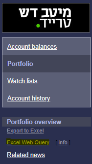
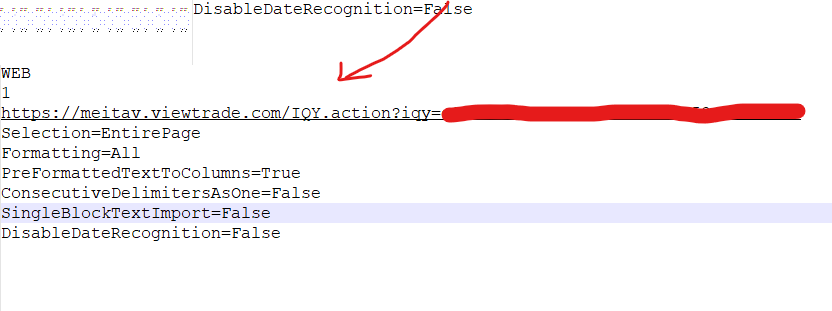

# MeitavAlternateView
[](https://github.com/Nicokalak/MeitavAlternateView/actions/workflows/docker-image.yml)

## About The Project
This project provides alternative view for your Meitav Dash portfolio.

## Getting Started
You will need to generate excel web query for your portfolio.

1. go to your account and click excel web query



2. open the file in text editor (e.g. Notepade++) and copy the linnk



3. run as docker container

```shell
  docker run -d -v <path_to_conf>:/app/config.json -e TZ='Asia/Jerusalem' -e portfolio_link='<your link>' -p 8080:8080 nicolak/meitav-alternate-view:latest 
  ```

4. open the app in browser http://localhost:8080/

## Running locally (without Docker)

1. Install dependencies:
```shell
uv sync
```

2. Set required environment variables:
```shell
export portfolio_link='<your link>'
export TZ='Asia/Jerusalem'
# optional: path to your config file
export config_path='<path_to_conf>/config.json'
```

3. Run the app:
```shell
uv run meitav_view
```

4. Open the app in browser http://localhost:8080/

## Quality checks
run with uv
```shell

uv run ruff check src --fix
uv run ruff format src
uv run mypy src
uv run pytest
```

## License
Distributed under the ISC License.
