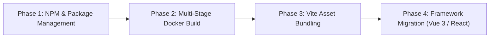

# UI Deployment Improvement Plan

## Executive Summary

This document outlines a phased strategy to modernize the frontend architecture, dependency management, and Docker deployment pipeline for **MeitavAlternateView**.

### Constraints Enforced
1. **Zero UI/UX Changes**: The visual design, Bootstrap 5 layout, tables, charts, dark mode, and user interactions will remain 100% identical.
2. **Incremental Stability**: Every phase is fully functional, backwards-compatible, and runnable without breaking the Python backend or production environment.

---

## Architectural Comparison & Suggestions

### 1. Package Manager: `npm` vs `download_static_assets.sh`
* **Current State**: Shell script downloading raw CDN files via `curl` based on `static_deps.txt`, saving pre-compiled minified files directly into Git (`src/meitav_view/static/js`).
* **Proposed State**: Standard `package.json` utilizing `npm` (or `pnpm`).
* **Benefits**:
  * Semantic versioning and lockfile (`package-lock.json`) for reproducible builds.
  * Audit vulnerabilities via `npm audit`.
  * Removes ~2MB+ of minified vendor binaries (`xlsx.full.min.js`, `chart.umd.min.js`, `bootstrap.bundle.min.js`) from Git tracking.

### 2. Frontend Framework Selection for Migration

| Option | Pros | Cons | Recommendation |
| :--- | :--- | :--- | :--- |
| **Vue 3 + Vite** | • Template syntax directly mirrors existing HTML<br>• Seamless integration with Bootstrap 5 & Chart.js<br>• Minimal boilerplate & lightweight reactivity | • Additional toolchain step | ⭐ **Recommended**: Easiest migration path without changing HTML/CSS structures. |
| **React + Vite** | • Huge ecosystem & wide community adoption | • Requires rewriting HTML templates into JSX<br>• More boilerplate for wrapping legacy DOM plugins (Bootstrap Table) | Good alternative if team is React-focused. |
| **Svelte 5 + Vite** | • Zero-runtime overhead<br>• Very clean syntax | • Smaller ecosystem for wrapper libraries | Viable lightweight alternative. |

---

## Phased Implementation Roadmap



---

### Phase 1: NPM & Dependency Management Adoption
* **Goal**: Replace curl-based `static_deps.txt` script with standard package manager management (`package.json`).
* **Key Steps**:
  1. Initialize `package.json` in the root folder with npm dependencies:
     * `bootstrap`, `@popperjs/core`, `jquery`, `chart.js`, `chartjs-adapter-moment`, `moment`, `bootstrap-table`, `tableexport.jquery.plugin`, `xlsx`, `@fortawesome/fontawesome-free`, `bootstrap-icons`.
  2. Create a lightweight build/sync script (`npm run sync-static` or `copy-assets`) that copies node_modules artifacts to `src/meitav_view/static/`.
  5. **Automating HTML SRI Digest Verification**:
     * **Problem**: Currently `index.html` uses hardcoded Subresource Integrity (`integrity="sha384-..."`) attributes for JS/CSS files. Updating npm dependencies changes the file contents and their hashes, breaking SRI if unupdated.
     * **Solution**:
       - *Phase 1 & 2 (Node sync script)*: A 15-line Node.js sync script uses the built-in `crypto` package to compute SHA-384 hashes of copied static files and dynamically update or inject `integrity="sha384-<base64>"` attributes into `index.html`.
       - *Phase 3 & 4 (Vite bundler)*: Vite uses content-hashed bundle URLs (e.g. `index-C8a9f2x.js`) for automatic cache-busting, and plugins like `vite-plugin-sri` generate and inject accurate SRI `integrity` digests into `index.html` automatically during build.
* **App State**: 100% operational; no change to backend or frontend code.

---

### Phase 2: Multi-Stage Docker Build Implementation
* **Goal**: Isolate frontend asset gathering/building into a dedicated Docker build stage.
* **Key Steps**:
  1. Refactor `Dockerfile` into a multi-stage architecture:
     ```dockerfile
     # Stage 1: Build & assemble frontend assets
     FROM node:20-alpine AS frontend-builder
     WORKDIR /app
     COPY package.json package-lock.json ./
     RUN npm ci
     COPY scripts/sync-assets.js ./scripts/
     RUN node scripts/sync-assets.js

     # Stage 2: Python base runtime
     FROM python:3.12-slim AS base
     ENV PYTHONUNBUFFERED=1 POETRY_VIRTUALENVS_CREATE=false
     RUN pip install --no-cache-dir poetry
     WORKDIR /app

     # Copy Python requirements & application
     COPY pyproject.toml poetry.lock ./
     COPY src src
     # Copy compiled static assets from frontend-builder
     COPY --from=frontend-builder /app/src/meitav_view/static /app/src/meitav_view/static

     FROM base AS runtime
     RUN poetry install --without dev --only main --no-interaction --no-ansi && rm -rf /root/.cache/
     EXPOSE 8080
     HEALTHCHECK CMD poetry run python src/meitav_view/healthcheck.py || exit 1
     CMD ["poetry", "run", "meitav_view"]
     ```
  2. Test local docker build (`docker build -t meitav-view .`).
  3. Remove tracked vendor binaries from git.
* **App State**: Docker images build cleanly with zero checked-in vendor dependencies. App remains 100% operational.

---

### Phase 3: Modern Build Tooling Integration (Vite Setup)
* **Goal**: Introduce **Vite** as a frontend bundler to enable ES Modules, tree shaking, minification, and Hot Module Replacement (HMR).
* **Key Steps**:
  1. Add `vite` and `@vitejs/plugin-legacy` to `package.json`.
  2. Restructure frontend source into a clean directory (e.g. `frontend/` or `src/frontend/`):
     * Move `table.js`, `trendschart.js`, `edit-watchlist.js`, `darkmode.js`, and `main.css` into ES modules.
  3. Configure `vite.config.js` to output bundled static assets directly into `src/meitav_view/static/dist/` (or update Flask paths).
  4. Configure Vite dev server to proxy `/portfolio`, `/trends`, `/watchList`, `/marketState` requests to Flask (`http://localhost:8080`) during development.
* **App State**: Faster local development loop with HMR; production build serves optimized bundled JS/CSS assets.

---

### Phase 4: UI Framework Migration (Vue 3 / React with Vite)
* **Goal**: Transition custom vanilla DOM scripts (`table.js`, `trendschart.js`, etc.) to reactive framework components without changing the visual UI.
* **Key Steps**:
  1. Setup **Vue 3** (or React) inside Vite build setup.
  2. Create modular UI components preserving exact HTML/Bootstrap 5 markup:
     * `PortfolioTable.vue` — Encapsulates Bootstrap Table, search filter (with regex), export options.
     * `TrendsChart.vue` — Encapsulates Chart.js rendering & controls.
     * `WatchlistModal.vue` — Encapsulates interactive modal & API POST sync.
     * `DarkModeToggle.vue` — Manages theme state & localStorage sync.
  3. Update `app.py` to serve single entry point `index.html` referencing Vite bundle.
* **App State**: Fully modern frontend architecture, high maintainability, reactive state, identical end-user UI.

---

## Risk Management & Testing Plan

1. **Regression Testing**:
   * Verify API contracts (`/portfolio`, `/trends`, `/marketState`, `/watchList`).
   * Verify table search (including regex table search), sorting, pagination, and Excel export.
   * Verify dark mode toggling and local storage state persistence.
2. **Container Security & Size**:
   * Multi-stage build prevents `node_modules` from polluting the final Python container image.
