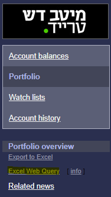
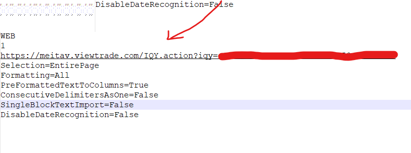

# MeitavAlternateView

## About The Project
This project provides alternative view for your Meitav Dash portfolio.

## Getting Started
You will need to generate excel web query for your portfolio.

1. go to your account and click excel web query



2. open the file in text editor (e.g. Notepade++) and copy the linnk



3. run as docker container

````  docker run -d -e TZ='Asia/Jerusalem' -e portfolio_link='<your link>' -p 8080:8080 nicolak/meitav-alternate-view:latest ````

4. open the app in browser http://localhost:8080/


## License
Distributed under the ISC License.
